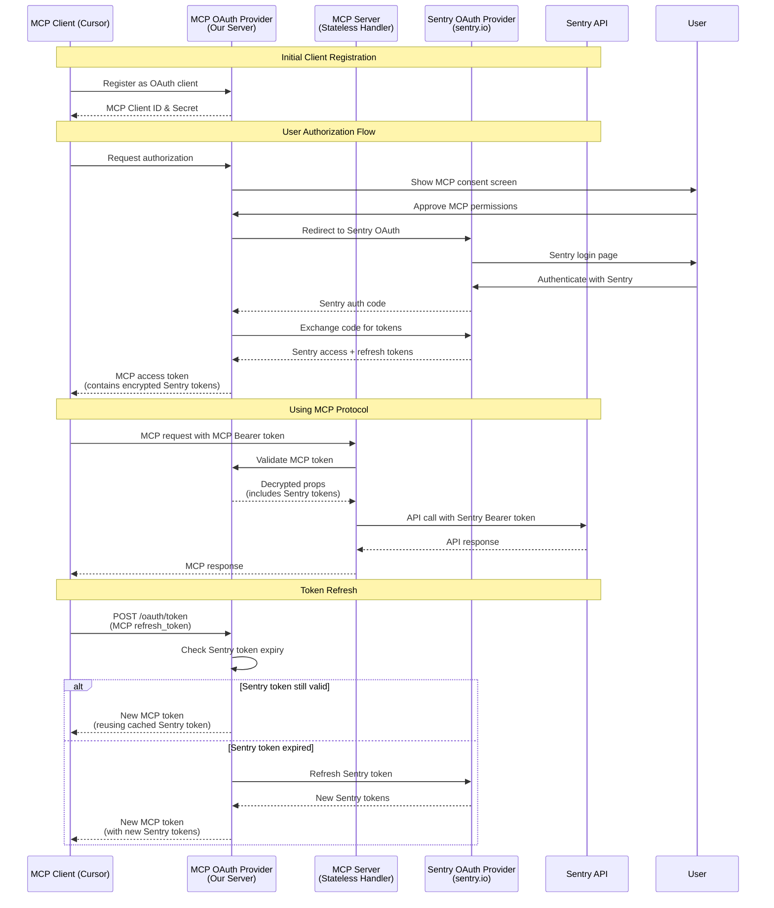
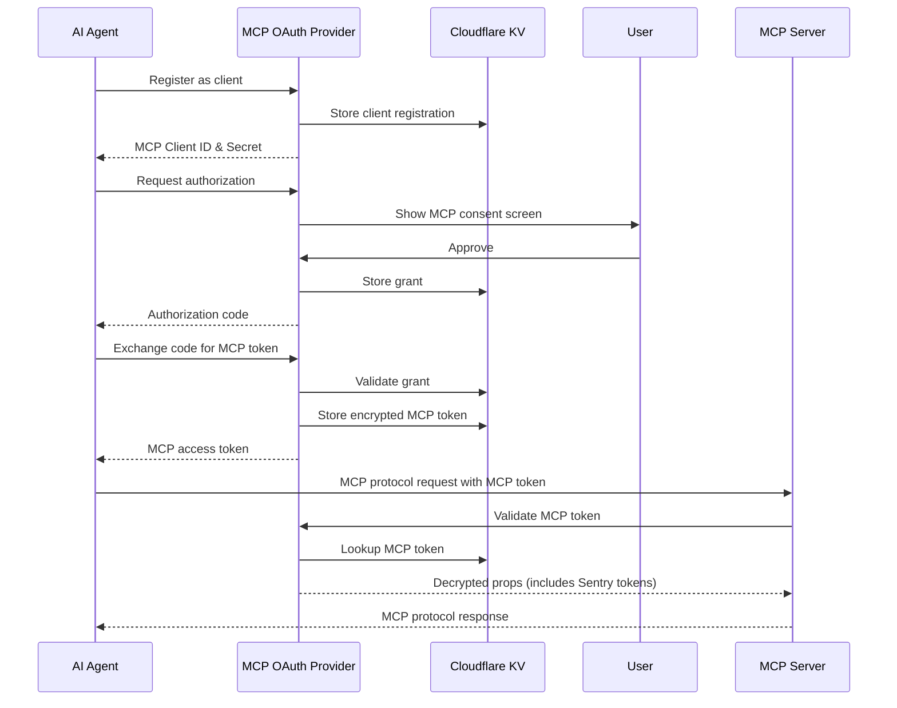

# OAuth Architecture: MCP OAuth vs Sentry OAuth

## Two Separate OAuth Systems

The Sentry MCP implementation involves **two completely separate OAuth providers**:

### 1. MCP OAuth Provider (Our Server)
- **What it is**: Our own OAuth 2.0 server built with `@cloudflare/workers-oauth-provider`
- **Purpose**: Authenticates MCP clients (like Cursor, VS Code, etc.)
- **Tokens issued**: MCP access tokens and MCP refresh tokens
- **Storage**: Uses Cloudflare KV to store encrypted tokens
- **Endpoints**: `/oauth/register`, `/oauth/authorize`, `/oauth/token`

### 2. Sentry OAuth Provider (Sentry's Server)
- **What it is**: Sentry's official OAuth 2.0 server at `sentry.io`
- **Purpose**: Authenticates users and grants API access to Sentry
- **Tokens issued**: Sentry access tokens and Sentry refresh tokens
- **Storage**: Tokens are stored encrypted within MCP's token props
- **Endpoints**: `https://sentry.io/oauth/authorize/`, `https://sentry.io/oauth/token/`

## High-Level Flow

The system uses a dual-token approach:
1. **MCP clients** authenticate with **MCP OAuth** to get MCP tokens
2. **MCP OAuth** authenticates with **Sentry OAuth** to get Sentry tokens
3. **MCP tokens** contain encrypted **Sentry tokens** in their payload
4. When serving MCP requests, the server uses Sentry tokens to call Sentry's API

### Complete Flow Diagram



## Key Concepts

### Token Types

| Token Type | Issued By | Used By | Contains | Purpose |
|------------|-----------|---------|----------|----------|
| **MCP Access Token** | MCP OAuth Provider | MCP Clients | Encrypted Sentry tokens | Authenticate to MCP Server |
| **MCP Refresh Token** | MCP OAuth Provider | MCP Clients | Grant reference | Refresh MCP access tokens |
| **Sentry Access Token** | Sentry OAuth | MCP Server | User credentials | Call Sentry API |
| **Sentry Refresh Token** | Sentry OAuth | MCP OAuth Provider | Refresh credentials | Refresh Sentry tokens |

### Not a Simple Proxy

**Important**: MCP is NOT an HTTP proxy that forwards requests. Instead:
- MCP implements the **Model Context Protocol** (tools, prompts, resources)
- Clients send MCP protocol messages, not HTTP requests
- MCP Server executes these commands using Sentry's API
- Responses are MCP protocol messages, not raw HTTP responses

## Technical Implementation

### MCP OAuth Provider Details

The MCP OAuth Provider is built with `@cloudflare/workers-oauth-provider` and provides:

1. **Dynamic client registration** - MCP clients can register on-demand
2. **PKCE support** - Secure authorization code flow
3. **Token management** - Issues and validates MCP tokens
4. **Consent UI** - Custom approval screen for permissions
5. **Token encryption** - Stores Sentry tokens encrypted in MCP token props

### Sentry OAuth Integration

The integration with Sentry OAuth happens through:

1. **Authorization redirect** - After MCP consent, redirect to Sentry OAuth
2. **Code exchange** - Exchange Sentry auth code for tokens
3. **Token storage** - Store Sentry tokens in MCP token props
4. **Token refresh** - Use Sentry refresh tokens to get new access tokens

## Key Concepts

### How the MCP OAuth Provider Works



## Implementation Details

### 1. MCP OAuth Provider Configuration

The MCP OAuth Provider is configured in `src/server/index.ts`:

```typescript
const oAuthProvider = new OAuthProvider({
  apiHandlers: {
    "/sse": createMcpHandler("/sse", true),
    "/mcp": createMcpHandler("/mcp", false),
  },
  defaultHandler: app,  // Hono app for non-OAuth routes
  authorizeEndpoint: "/oauth/authorize",
  tokenEndpoint: "/oauth/token", 
  clientRegistrationEndpoint: "/oauth/register",
  scopesSupported: Object.keys(SCOPES),
});
```

### 2. API Handler

The `apiHandler` is a protected endpoint that requires valid OAuth tokens:

- `/mcp` - MCP protocol endpoint (HTTP transport)

The handler receives:
- `request`: The incoming request
- `env`: Cloudflare environment bindings
- `ctx`: Execution context with `ctx.props` containing decrypted user data

### 3. Token Structure

MCP tokens contain encrypted properties including Sentry tokens:

```typescript
interface WorkerProps {
  id: string;                    // Sentry user ID
  accessToken: string;            // Sentry access token
  refreshToken?: string;          // Sentry refresh token
  accessTokenExpiresAt?: number;  // Sentry token expiry timestamp
  clientId: string;               // MCP client ID
  scope: string;                  // MCP permissions granted
  grantedSkills?: string[];       // Skills granted (primary authorization)
  // grantedScopes is deprecated and will be removed Jan 1, 2026
}
```

### 4. URL Constraints Challenge

#### The Problem

The MCP server needs to support URL-based constraints like `/mcp/sentry/javascript` to limit agent access to specific organizations/projects. However:

1. OAuth Provider only does prefix matching (`/mcp` matches `/mcp/*`)
2. The MCP handler needs to extract constraints from URL paths
3. URL path parameters must be preserved through the OAuth middleware

#### The Solution

The MCP handler parses URL path segments to extract organization and project constraints:

**Example URLs:**
- `/mcp` - No constraints (full access within granted scopes)
- `/mcp/sentry` - Organization constraint (limited to "sentry" org)
- `/mcp/sentry/javascript` - Organization + project constraints

The handler extracts these constraints, combines them with authentication data from the OAuth provider (via ExecutionContext), and builds the complete ServerContext. This context determines which resources tools can access.

## Storage (KV Namespace)

The MCP OAuth Provider uses `OAUTH_KV` namespace to store:

1. **MCP Client registrations**: `client:{clientId}` - MCP OAuth client details
2. **MCP Authorization grants**: `grant:{userId}:{grantId}` - User consent records for MCP
3. **MCP Access tokens**: `token:{userId}:{grantId}:{tokenId}` - Encrypted MCP tokens (contains Sentry tokens)
4. **MCP Refresh tokens**: `refresh:{userId}:{grantId}:{refreshId}` - For MCP token renewal

### Token Storage Structure

When a user completes the full OAuth flow, the MCP OAuth Provider stores Sentry tokens inside MCP token props:

```typescript
// In /oauth/callback after exchanging code with Sentry
const { redirectTo } = await c.env.OAUTH_PROVIDER.completeAuthorization({
  // ... other params
  props: {
    id: payload.user.id,                    // From Sentry
    accessToken: payload.access_token,       // Sentry's access token
    refreshToken: payload.refresh_token,     // Sentry's refresh token
    accessTokenExpiresAt: Date.now() + payload.expires_in * 1000,
    clientId: oauthReqInfo.clientId,         // MCP client ID
    scope: oauthReqInfo.scope.join(" "),     // MCP scopes
    grantedSkills: Array.from(validSkills),  // Skills granted (primary authorization)
    // ... other fields
  }
});
```

## Token Refresh Implementation

### Dual Refresh Token System

The system maintains two separate refresh flows:

1. **MCP Token Refresh**: When MCP clients need new MCP access tokens
2. **Sentry Token Refresh**: When Sentry access tokens expire (handled internally)

### MCP Token Refresh Flow

When an MCP client's token expires:

1. Client sends refresh request to MCP OAuth: `POST /oauth/token` with MCP refresh token
2. MCP OAuth invokes `tokenExchangeCallback` function
3. Callback checks if cached Sentry token is still valid (with 2-minute safety window)
4. If Sentry token is valid, returns new MCP token with cached Sentry token
5. If Sentry token expired, refreshes with Sentry OAuth and updates storage

### Token Exchange Callback Implementation

```typescript
// tokenExchangeCallback in src/server/oauth/helpers.ts
export async function tokenExchangeCallback(options, env) {
  // Only handle MCP refresh_token requests
  if (options.grantType !== "refresh_token") {
    return undefined;
  }

  // Extract Sentry refresh token from MCP token props
  const sentryRefreshToken = options.props.refreshToken;
  if (!sentryRefreshToken) {
    throw new Error("No Sentry refresh token available in stored props");
  }

  // Smart caching: Check if Sentry token is still valid
  const sentryTokenExpiresAt = props.accessTokenExpiresAt;
  if (sentryTokenExpiresAt && Number.isFinite(sentryTokenExpiresAt)) {
    const remainingMs = sentryTokenExpiresAt - Date.now();
    const SAFE_WINDOW_MS = 2 * 60 * 1000; // 2 minutes safety
    
    if (remainingMs > SAFE_WINDOW_MS) {
      // Sentry token still valid - return new MCP token with cached Sentry token
      return {
        newProps: { ...options.props },
        accessTokenTTL: Math.floor(remainingMs / 1000),
      };
    }
  }

  // Sentry token expired - refresh with Sentry OAuth
  const [sentryTokens, errorResponse] = await refreshAccessToken({
    client_id: env.SENTRY_CLIENT_ID,
    client_secret: env.SENTRY_CLIENT_SECRET,
    refresh_token: sentryRefreshToken,
    upstream_url: "https://sentry.io/oauth/token/",
  });

  // Update MCP token props with new Sentry tokens
  return {
    newProps: {
      ...options.props,
      accessToken: sentryTokens.access_token,      // New Sentry access token
      refreshToken: sentryTokens.refresh_token,    // New Sentry refresh token
      accessTokenExpiresAt: Date.now() + sentryTokens.expires_in * 1000,
    },
    accessTokenTTL: sentryTokens.expires_in,
  };
}
```

### Error Scenarios

1. **Missing Sentry Refresh Token**: 
   - Error: "No Sentry refresh token available in stored props"
   - Resolution: Client must re-authenticate through full OAuth flow

2. **Sentry Refresh Token Invalid**: 
   - Error: Sentry OAuth returns 401/400
   - Resolution: Client must re-authenticate with both MCP and Sentry

3. **Network Failures**: 
   - Error: Cannot reach Sentry OAuth endpoint
   - Resolution: Retry with exponential backoff or re-authenticate

The 2-minute safety window prevents edge cases with clock skew and processing delays between MCP and Sentry.

## Security Features

1. **PKCE**: MCP OAuth uses PKCE to prevent authorization code interception
2. **Token encryption**: Sentry tokens encrypted within MCP tokens using WebCrypto
3. **Dual consent**: Users approve both MCP permissions and Sentry access
4. **Scope enforcement**: Both MCP and Sentry scopes limit access
5. **Token expiration**: Both MCP and Sentry tokens have expiry times
6. **Refresh token rotation**: Sentry issues new refresh tokens on each refresh

## Discovery Endpoints

The MCP OAuth Provider automatically provides:

- `/.well-known/oauth-authorization-server` - MCP OAuth server metadata
- `/.well-known/oauth-protected-resource` - MCP resource server info

Note: These describe the MCP OAuth server, not Sentry's OAuth endpoints.

## Integration Between MCP OAuth and MCP Server

The MCP Server (stateless handler) receives context via closure capture:

1. **Props via ExecutionContext**: Decrypted data from MCP token (includes Sentry tokens)
2. **Constraints from URL**: Organization/project limits parsed from URL path
3. **Context capture**: Server built with context, captured in tool handler closures

The MCP Server then uses the Sentry access token from context to make Sentry API calls.

## Limitations

1. **No direct Hono integration**: OAuth Provider expects specific handler signatures
2. **Constraint extraction**: Must parse URL segments to extract organization/project constraints

## Why Use Two OAuth Systems?

### Benefits of the Dual OAuth Approach

1. **Security isolation**: MCP clients never see Sentry tokens directly
2. **Token management**: MCP can refresh Sentry tokens transparently
3. **Permission layering**: MCP permissions separate from Sentry API scopes
4. **Client flexibility**: MCP clients don't need to understand Sentry OAuth

### Why Not Direct Sentry OAuth?

If MCP clients used Sentry OAuth directly:
- Clients would need to manage Sentry token refresh
- No way to add MCP-specific permissions
- Clients would have raw Sentry API access (security risk)
- No centralized token management

### Implementation Complexity

The MCP OAuth Provider (via `@cloudflare/workers-oauth-provider`) provides:
- OAuth 2.0 authorization flows
- Dynamic client registration
- Token issuance and validation
- PKCE support
- Consent UI
- Token encryption
- KV storage
- Discovery endpoints

Reimplementing this would be complex and error-prone.

## Related Documentation

- [Cloudflare OAuth Provider](https://github.com/cloudflare/workers-oauth-provider)
- [OAuth 2.0 Specification](https://oauth.net/2/)
- [Dynamic Client Registration](https://www.rfc-editor.org/rfc/rfc7591.html)
- [PKCE](https://www.rfc-editor.org/rfc/rfc7636)