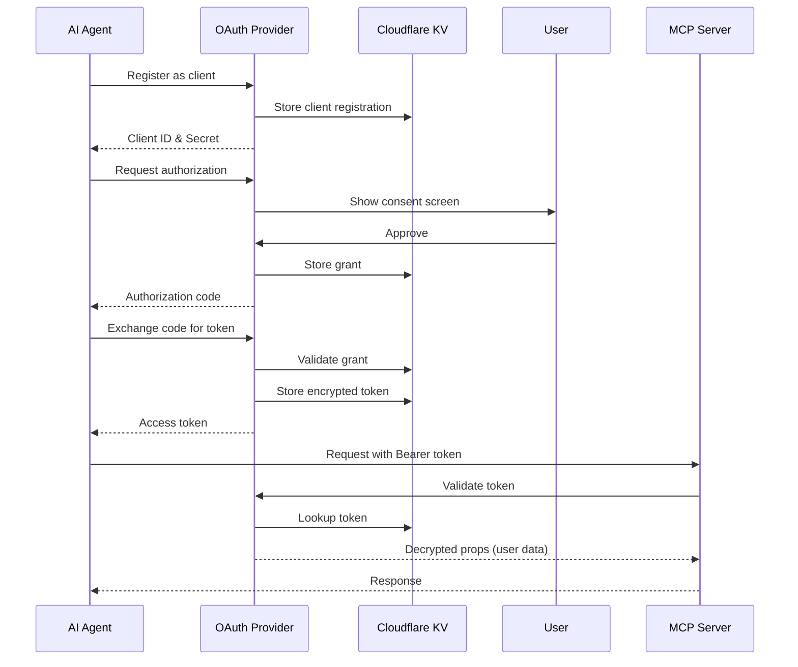

# OAuth Architecture

## Overview

The Sentry MCP Cloudflare implementation uses the `@cloudflare/workers-oauth-provider` library to act as an **OAuth 2.0 Authorization Server**. This is NOT an OAuth proxy or client - it's a full OAuth server that:

1. Issues its own access tokens
2. Manages client registrations dynamically
3. Handles authorization flows with consent
4. Stores encrypted user data in tokens

## Key Concepts

### OAuth Provider as a Server

The Cloudflare OAuth Provider is a complete OAuth 2.0 server implementation that:

- **Issues tokens**: Creates and manages its own access tokens (not proxying Sentry's)
- **Dynamic client registration**: Allows AI agents to register as OAuth clients on-the-fly
- **Token storage**: Uses Cloudflare KV to store encrypted tokens and grants
- **PKCE support**: Implements Proof Key for Code Exchange for security
- **Consent flow**: Manages user consent for agent permissions

### How It Works



## Implementation Details

### 1. Configuration

The OAuth Provider is configured in `src/server/index.ts`:

```typescript
const oAuthProvider = new OAuthProvider({
  apiHandlers: {
    "/sse": createMcpHandler("/sse", true),
    "/mcp": createMcpHandler("/mcp", false),
  },
  defaultHandler: app,  // Hono app for non-OAuth routes
  authorizeEndpoint: "/oauth/authorize",
  tokenEndpoint: "/oauth/token", 
  clientRegistrationEndpoint: "/oauth/register",
  scopesSupported: Object.keys(SCOPES),
});
```

### 2. API Handlers

The `apiHandlers` are protected endpoints that require valid OAuth tokens:

- `/mcp/*` - MCP protocol endpoints
- `/sse/*` - Server-sent events for MCP

These handlers receive:
- `request`: The incoming request
- `env`: Cloudflare environment bindings
- `ctx`: Execution context with `ctx.props` containing decrypted user data

### 3. Token Structure

Tokens contain encrypted user properties:

```typescript
interface WorkerProps {
  id: string;           // User ID
  accessToken: string;  // Sentry API token
  name: string;         // User name
  scope: string;        // Granted permissions
}
```

### 4. URL Constraints Challenge

#### The Problem

The MCP server needs to support URL-based constraints like `/mcp/sentry/javascript` to limit agent access to specific organizations/projects. However:

1. OAuth Provider only does prefix matching (`/mcp` matches `/mcp/*`)
2. The agents library rewrites URLs to `/streamable-http` before reaching the Durable Object
3. URL path parameters are lost in this rewrite

#### The Solution

We use HTTP headers to preserve constraints through the URL rewriting:

```typescript
const createMcpHandler = (basePath: string, isSSE = false) => {
  const handler = isSSE ? SentryMCP.serveSSE("/*") : SentryMCP.serve("/*");

  return {
    fetch: (request: Request, env: unknown, ctx: ExecutionContext) => {
      const url = new URL(request.url);
      
      // Extract constraints from URL
      const pathMatch = url.pathname.match(
        /^\/(mcp|sse)(?:\/([a-z0-9._-]+))?(?:\/([a-z0-9._-]+))?/i
      );
      
      // Pass constraints via headers (preserved through URL rewriting)
      const headers = new Headers(request.headers);
      if (pathMatch?.[2]) {
        headers.set("X-Sentry-Org-Slug", pathMatch[2]);
      }
      if (pathMatch?.[3]) {
        headers.set("X-Sentry-Project-Slug", pathMatch[3]);
      }
      
      const modifiedRequest = new Request(request, { headers });
      return handler.fetch(modifiedRequest, env, ctx);
    },
  };
};
```

## Storage (KV Namespace)

The OAuth Provider uses `OAUTH_KV` namespace to store:

1. **Client registrations**: `client:{clientId}` - OAuth client details
2. **Authorization grants**: `grant:{userId}:{grantId}` - User consent records
3. **Access tokens**: `token:{userId}:{grantId}:{tokenId}` - Encrypted tokens
4. **Refresh tokens**: `refresh:{userId}:{grantId}:{refreshId}` - For token renewal

## Security Features

1. **PKCE**: Prevents authorization code interception
2. **Token encryption**: User data encrypted in tokens using WebCrypto
3. **Consent management**: Users explicitly approve agent permissions
4. **Scope enforcement**: Limits what agents can access
5. **Token expiration**: Automatic token expiry and refresh

## Discovery Endpoints

The OAuth Provider automatically provides:

- `/.well-known/oauth-authorization-server` - OAuth server metadata
- `/.well-known/oauth-protected-resource` - Resource server info

## Integration with MCP

The MCP Durable Object (`SentryMCP`) receives:

1. **Props via constructor**: User data from OAuth token (via `ctx.props`)
2. **Constraints via headers**: Organization/project limits
3. **Both stored**: In Durable Object storage for session persistence

## Limitations

1. **No direct Hono integration**: OAuth Provider expects specific handler signatures
2. **URL rewriting**: Requires header-based constraint passing
3. **Props architecture mismatch**: OAuth passes props per-request, agents library expects them in constructor

## Why Not Replace It?

Reimplementing the OAuth Provider would require:

1. OAuth 2.0 authorization flow implementation
2. Dynamic client registration (RFC 7591)
3. Token issuance and validation
4. PKCE implementation (RFC 7636)
5. Consent management UI
6. Token encryption/decryption
7. KV storage management
8. Discovery endpoint implementation
9. Security vulnerability management

The Cloudflare OAuth Provider handles all of this correctly and securely. The header-passing pattern for constraints is a reasonable adapter between two different architectural patterns.

## Related Documentation

- [Cloudflare OAuth Provider](https://github.com/cloudflare/workers-oauth-provider)
- [OAuth 2.0 Specification](https://oauth.net/2/)
- [Dynamic Client Registration](https://www.rfc-editor.org/rfc/rfc7591.html)
- [PKCE](https://www.rfc-editor.org/rfc/rfc7636)